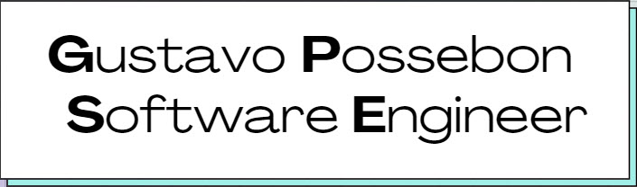

  
  
  <h6 align="right">by Stephanie Willekens</h6>

  
  

## Hi, I'm Gustavo Possebon </h2>

### Abstract

- 👨‍💻 I'm not currently working, but I'm looking 👀.
- 🌱 Learning more about and studying: **Mobile and Data Science**.
- 💙 Interests: 🎮 ,  📚 and ✈️.

### Languages and Tools

 

  
  
  
  
    
  
  
  
  
  
  
  

### Find me around the web 🌎:

- 💼 Connecting and sharing professional updates on <a href="https://www.linkedin.com/in/gustavopossebon/">LinkedIn</a>.
